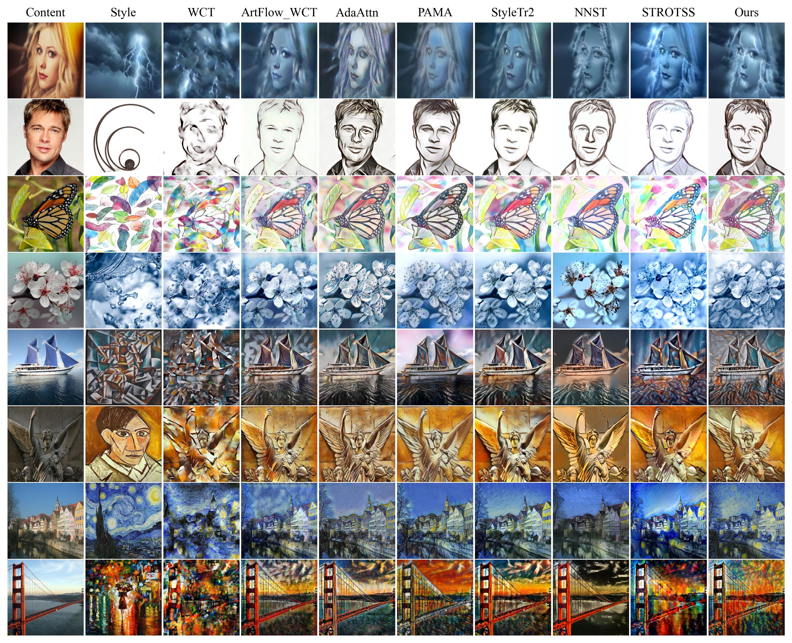

# The unusual effectiveness of image pyramid for style transfer



## Getting Started
Clone the repo:
```
git clone https://github.com/1e0nhardt/NST.git
```

Install the requirements:
```sh
conda create -n nst python=3.8
conda activate nst
pip install torch torchvision --index-url https://download.pytorch.org/whl/cu117
pip install opencv-python imageio einops piq rich tyro matplotlib pandas wandb tensorboard gradio
```

## Run a local Demo
```sh
python demo.py
```

## Direct use our method
```sh
python pipeline_main.py --content_path xx --style_path xx
```

## Acknowledgement
- [PAMA](https://github.com/luoxuan-cs/PAMA)
- [STROTSS]()
- [NNST]()
- [ARF]()
